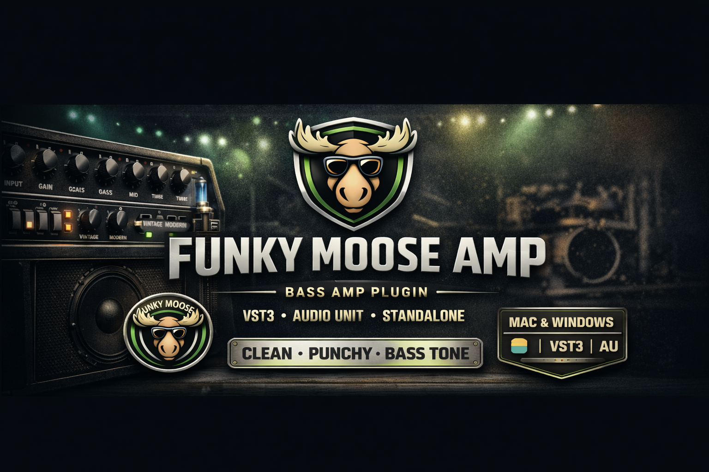
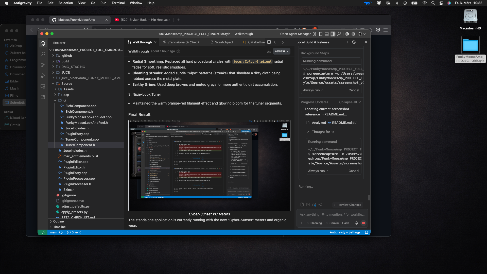

# Funky Moose Amp

<p align="center">
  
</p>


**Funky Moose Amp** is a clean and punchy bass amp plugin designed for groove, funk, slap and modern bass tones. 

Built with JUCE and C++, the plugin focuses on clarity, dynamic response and musical tone shaping. It’s designed to be a tone-shaping instrument rather than just a generic amp simulator.

---

## 🚀 Features

• **Premium Bass DSP**: High-fidelity amp modeling with extreme dynamic range.  
• **Built-in Tuner**: High-precision chromatic tuner integrated directly into the UI.  
• **MIDI Learn**: Real-time safe MIDI mapping. Map any knob or button in seconds.  
• **9 Selectable Skins**: Classic, Midnight, Electric, Toxic, and more to match your vibe.  
• **Octaver Module**: Massive analog-style sub-octave generator.  
• **Enveope Filter / ModFX**: touch-sensitive auto-wah, phaser and chorus.  
• **Saturation & Color**: Tube mode for harmonic warmth and Slap mode for 8kHz bite.  
• **Interactive Visual Engine**: The Moose reflects signal levels and compression in real-time.  
• **DSP Safety**: Soft-clipping and intelligent noise/NaN protection.

---

## 💾 Download

Get the latest stable release from the [Releases](https://github.com/blubass/FunkyMooseAmp/releases) page.

---


## 🛠 Installation

### macOS
1. **Audio Unit**: Move the `.component` file to `/Library/Audio/Plug-Ins/Components`
2. **VST3**: Move the `.vst3` file to `/Library/Audio/Plug-Ins/VST3`
3. **Standalone**: Move the `.app` to your `Applications` folder.

*Note: Since the plugin is not code-signed with an Apple Developer certificate, you may need to right-click -> Open or allow it in System Settings > Privacy & Security.*

### Windows
1. **VST3**: Move the `.vst3` file (folder) to `C:\Program Files\Common Files\VST3`

---

## 🏗 Build from Source

### Requirements
- **CMake** 3.22 or higher
- **JUCE 8** installed on your system
- C++17 compatible compiler (Xcode, MSVC, or GCC)

### Build Steps
```bash
# 1. Clone the repository
git clone https://github.com/blubass/FunkyMooseAmp.git
cd FunkyMooseAmp

# 2. Configure (Set JUCE_DIR if not in standard path)
cmake -B build -DCMAKE_BUILD_TYPE=Release 

# 3. Build
cmake --build build --config Release
```

---

## 📄 License
This project is licensed under the **MIT License**.

## ✍️ Author
**Uwe Arthur Felchle**  
Musician, composer and developer.  
[uwefelchle.at](https://uwefelchle.at)
