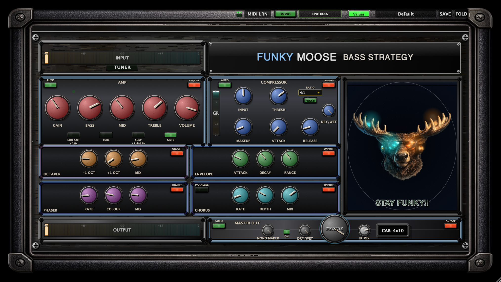

# Funky Moose Amp


*(Englische Version siehe [README.md](README.md))*

Ein hochgradig vielseitiges, hochmodernes Bassverstärker-Plugin, das speziell dafür entwickelt wurde, den Funk zu bringen! Gebaut mit dem modernen JUCE-Framework und mit einer dynamischen, interaktiven Benutzeroberfläche.

## Funktionsübersicht

### 1. **Tuner & Eingangsbereich**
* **Hochpräziser Tuner:** Immer oben links sichtbar. Reagiert sofort auf dein Eingangssignal.
* **Input-Regler:** Steuert die Menge des Signals, das in den Verstärker (Amp Head) geht.

### 2. **Verstärker & Tone-Modul (Amp & Tone)**
Das Herzstück des Moose. Ein eigens entwickelter Solid-State-Preamp mit optionalen Röhrencharakteristiken.
* **Gain:** Treib die Vorstufe von kristallklar bis hin zu dreckigem Overdrive.
* **Tone Stack (Bass / Mid / Treble):** Sehr reaktionsschnelle, analog modellierte EQs.
* **Volume:** Master-Ausgangslautstärke der Vorstufe.
* **Tube Saturation (Toggle):** Aktiviert eine asymmetrische Sättigungskurve im Röhrenstil, die dynamisch Obertöne hinzufügt.
* **Slap Mode (Toggle):** Ein Mid-Scoop bei 500Hz, gepaart mit einem Bass- & Höhen-Boost (+5dB), speziell abgestimmt für moderne Slap-Bass-Sounds.
* **Low Cut (Toggle):** Ein Hochpassfilter (HPF) bei 40Hz, um das Infraschall-Rumpeln (Subsonic Rumble) aufzuräumen und einen straffen Bassbereich (Low-End) zu erhalten.
* **Auto Gain:** Gleicht die Gesamtlautstärke automatisch an, wenn an den EQ-Reglern gedreht wird.

### 3. **Smart Kompressor (Compressor)**
Ein extrem sauberer, transparenter Kompressor nach VCA-Art.
* **Bedienelemente:** Input (Drive), Threshold, Makeup Gain, Attack, Release.
* **Ratio-Auswahl (Dropdown):** 4:1, 8:1, 12:1 und 20:1 (Limiting).
* **Punch-Schaltung (Toggle):** Hebt die Attack-Phase (Präsenz) hervor und strafft den Bassbereich, wodurch sich Basslinien in jedem Mix durchsetzen.
* **Auto-Makeup (AUTO):** Analysiert die Pegelreduzierung (Gain Reduction) und korrigiert automatisch den Ausgangspegel, um die Lautstärke konstant zu halten.
* **Dry/Wet-Mix:** Eingebaute parallele Kompression ganz ohne Phasenprobleme.
* **Gain-Reduction-Meter:** Visuelles Echtzeit-Feedback, wie stark der Kompressor zupackt.

### 4. **Effekte-Sektion (ModFX)**
Integrierte, hochwertige Effekte, wahlweise seriell oder parallel im Signalweg einschleifbar.
* **Octaver:** Subbass-Generator. Mixt analog klingende "-1 Oktave" und "+1 Oktave" Signale.
* **Envelope Filter (Auto-Wah):** Anschlagdynamischer Filter. Bedienelemente: Attack, Decay, Range.
* **Phaser:** Klassischer optischer 4-Stufen-Phaser mit Reglern für Rate (Geschwindigkeit), Colour (Feedback) und Mix.
* **Chorus:** Ein satter, analog klingender Stereo-Eimerketten-Chorus.
* **Parallel-Modus (Toggle):** Verschiebt den Chorus & Phaser in einen parallelen Signalweg neben dem trockenen/verstärkten Signal, um den maximalen Bass-Punch im Hauptsignal zu erhalten und dem Sound nur Breite (Width) beizumischen.

### 5. **Master-Sektion & Eigene Cab-IRs (Boxensimulation)**
* **Master Out:** Steuert den finalen Output des Plugins.
* **Mono Maker:** Summiert alle tiefen Frequenzen (unterhalb eines bestimmten Grenzwertes) zu Mono. Dies sorgt für absolute Phasen-Kohärenz in den wichtigen, tiefen Registern.
* **Master Dry/Wet:** Mische das gesamte bearbeitete Signal mit deinem cleanen DI-Signal.
* **CAB IR Loader (CAB: OFF/ON):** Lade benutzerdefinierte Impulsantworten (Impulse Responses). Das Plugin enthält bereits maßgeschneiderte "Funky Moose" Bassboxen-Antworten. Einfach umschaltbar und mischbar per "IR Mix".

### 6. **Die interaktive "Funky Moose"-Benutzeroberfläche**
Der Elch (Moose) ist nicht nur ein Logo; er ist eine dynamische Visualisierung deines Tons!
* **Pegel-Visualisierung:** Der Elch reagiert sowohl auf deinen RMS-Eingangs- als auch den Ausgangspegel.
* **Kompressor-Feedback:** Bei starker Pegelreduzierung verändern sich die Hintergrundtextur und das Nachleuchten (Glow).
* **Sonnenbrillen-Glow:** Wenn die "Punch"-Schaltung im Kompressor aktiviert wird, erstrahlt die Sonnenbrille des Elchs in einem grellen Neon-Glühen – und leuchtet bei maximalem Signal satt auf!
* **State-of-the-Art Look & Feel:** Besticht durch skeuomorphische Ästhetik mit realistischen Schatten, leuchtenden Kippschalter-Lampen (State Lights) und einem eigenen Pop-up-System für Presets und Ratios.

## Presets & MIDI
* **Presets:** Enthält Werkspresets ("Factory Bank"), von cleanen DI-Sounds, Vintage Motown, modernem Slap, Synth-Bass bis hin zu starkem Overdrive. Eigenes Speichern in "User"-Bänken wird ebenfalls unterstützt.
* **MIDI Learn:** Einfach auf "MIDI LRN" klicken und direkt danach einen Regler an deinem physischen Controller (z.B. einem Akai MPK Mini) drehen. Schon ist der Parameter mit deinem Regler verknüpft!

## Build-Anweisungen (Für Entwickler)
Kann als VST3, AU und als eigenständige Standalone-App mit CMake gebaut werden.
```bash
cmake -B build
cmake --build build --target FUNKY_MOOSE_AMP_Standalone
```
